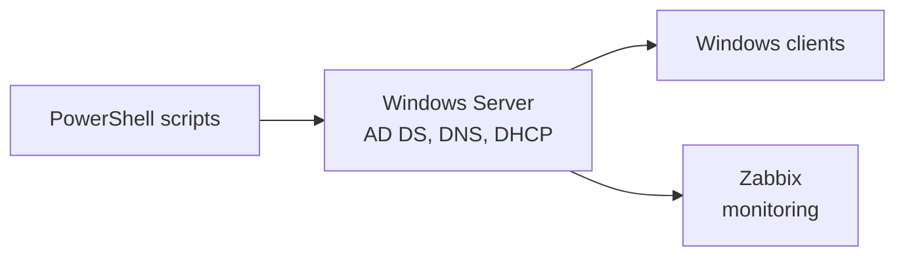

# Windows & Active Directory Home Lab

> A virtualized Windows Server environment to practice Active Directory administration, network services and automation.

## Architecture

## Stack
- **VMware** – virtualization
- **Windows Server** – AD DS, DNS, DHCP
- **GPO** – security and configuration policies
- **PowerShell** – automation
- **Zabbix** – monitoring

## Automation scripts
| Script | Purpose |
| --- | --- |
| <!-- TODO e.g. New-LabUsers.ps1 --> | <!-- bulk user creation from CSV --> |

## GPOs implemented
<!-- TODO: list with purpose, e.g. password policy, USB restriction -->

## What I learned
<!-- TODO -->
