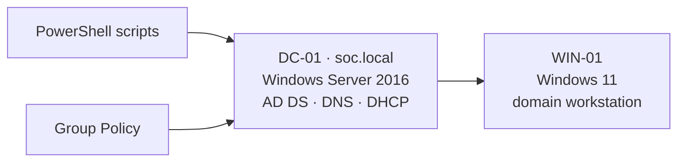

# Windows & Active Directory Home Lab

> A virtualized Windows Server environment to practice Active Directory administration, Group Policy hardening, PowerShell automation. It is the foundation reused as the target domain in my [SOC Home Lab](https://github.com/Yassine-ElJide/soc-home-lab).

## Architecture



| Host | Role | OS |
| --- | --- | --- |
| DC-01 | AD DS, DNS, DHCP for domain `soc.local` | Windows Server 2016 |
| WIN-01 | Domain workstation | Windows 11 Pro |

## Stack
- **VirtualBox**: virtualization
- **Windows Server 2016**: AD DS, DNS, DHCP
- **Group Policy (GPO)**: security and configuration baseline
- **PowerShell**: provisioning and reporting automation

## Automation scripts
| Script | Purpose |
| --- | --- |
| [`scripts/New-LabOU.ps1`](scripts/New-LabOU.ps1) | Create the OU structure for the domain |
| [`scripts/New-LabUsers.ps1`](scripts/New-LabUsers.ps1) | Bulk-create users from [`scripts/users.csv`](scripts/users.csv), place them in the right OU and group |
| [`scripts/Get-StaleAccounts.ps1`](scripts/Get-StaleAccounts.ps1) | Report accounts inactive for N days (offboarding / hygiene) |
| [`scripts/Get-PrivilegedGroupMembers.ps1`](scripts/Get-PrivilegedGroupMembers.ps1) | Audit members of privileged groups, export to CSV |

All scripts use the `ActiveDirectory` module, support `-WhatIf` where they change state, and are commented.

## OU design
```
soc.local
└── OU=SOC
    ├── OU=Users
    │   ├── OU=IT
    │   ├── OU=Finance
    │   └── OU=HR
    ├── OU=Groups
    ├── OU=Workstations
    └── OU=Servers
```

## GPOs implemented
See [`gpo/baseline.md`](gpo/baseline.md) for the full baseline and rationale.

| GPO | Scope | Purpose | ATT&CK mitigation |
| --- | --- | --- | --- |
| Password & Lockout Policy | Domain | 14-char minimum, lockout after 5 failures | T1110 Brute force |
| Audit Policy | Domain Controllers | Enable logon, credential validation, account-mgmt and Kerberos auditing (feeds the SOC lab) | Detection |
| USB Storage Restriction | Workstations | Block removable storage write | T1052 Exfil over USB |
| Disable SMBv1 | All | Remove legacy SMB | T1210 Exploitation |
| Screen Lock | Workstations | 10-min inactivity lock | Unattended session abuse |

## What I learned
- Designing an OU tree so GPOs and delegation map to the org, not to individual objects.
- PowerShell for repeatable provisioning: creating users from a CSV in seconds and keeping it idempotent.
- Why DC audit policy is the prerequisite for everything in the SOC lab: no auditing, no alerts.

## Next steps
- Add a tiered admin model (Tier 0/1/2) and LAPS for local admin passwords
- Package the baseline GPOs as a backup/import for one-command rebuild

> ⚠️ Lab environment only. No production data or credentials.
